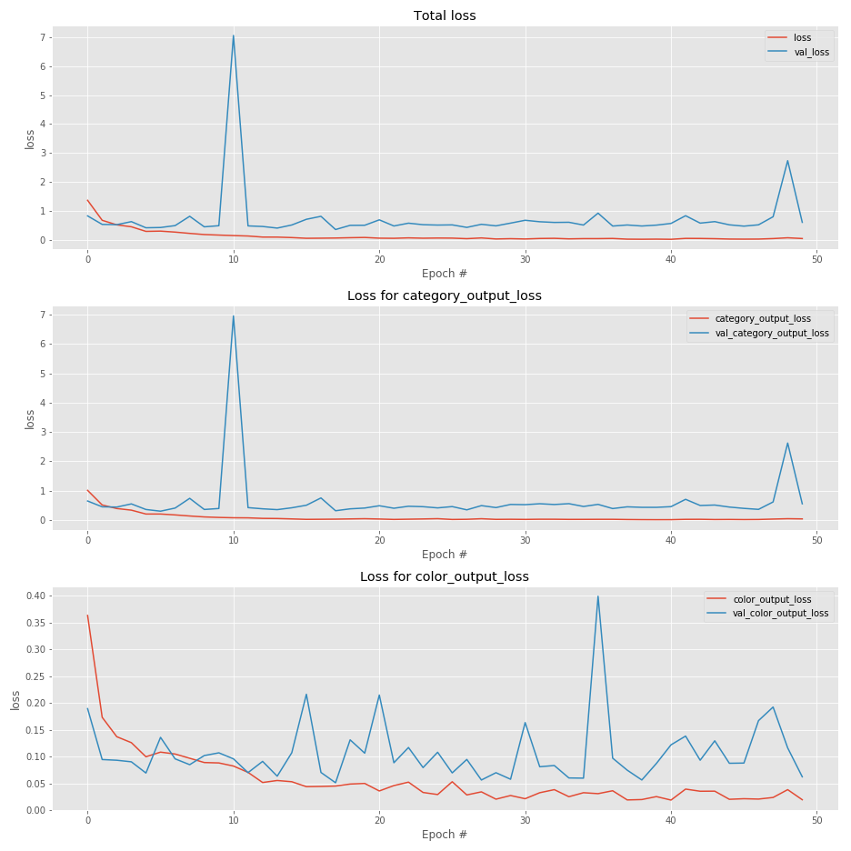

# Clothing Classification

A small VGGnet used to classify clothes as per color.

Reference research paper : https://arxiv.org/pdf/1409.1556/

Model 1
------------------------

Training results are pretty okay, but can do better with more data and tuning.

Model 2
--------------------------
Branched model that outputs different labels

- Model

- Loss Summary

- Accuracy Summary

